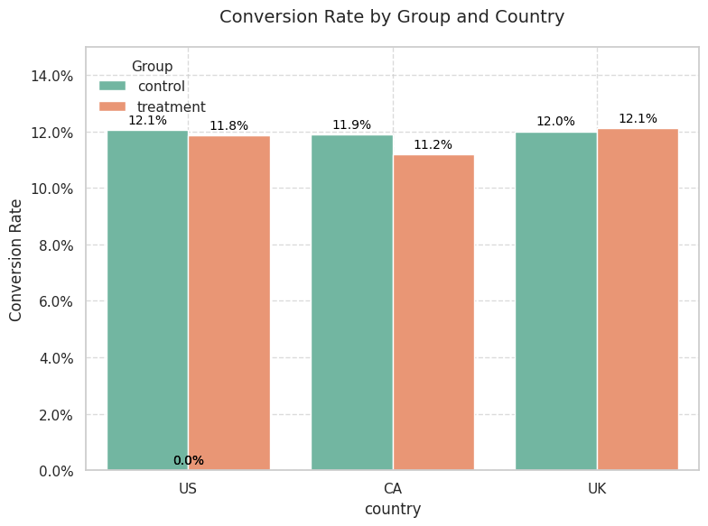

# E-Commerce Website A/B Testing Analysis


## Project Overview

This repository contains a comprehensive analysis of an A/B test conducted for an e-commerce website. The test evaluated whether a newly designed web page increased user conversion rates compared to the existing page across multiple markets (US, UK, and CA).

The datasets used are from Kaggle and can be found [here](https://www.kaggle.com/datasets/putdejudomthai/ecommerce-ab-testing-2022-dataset1/data).

### Business Context

The e-commerce company developed a new web page design aimed at increasing conversion rates (the percentage of users who make a purchase). This analysis determines whether the new design delivers statistically significant improvements over the current design, both overall and within specific country markets.

## Data Sources

The analysis uses two primary datasets:

1. **`ab_data.csv`** - Contains user interactions with web pages:
   - `user_id`: Unique identifier for each website visitor
   - `timestamp`: Visit timestamp
   - `group`: Test assignment (control or treatment)
   - `landing_page`: Page version shown (old_page or new_page)
   - `converted`: Purchase status (1=converted, 0=not converted)

2. **`countries.csv`** - Contains country information for each user:
   - `user_id`: Matches with the A/B testing dataset
   - `country`: User location (UK, US, or CA)

## Key Findings

Our rigorous analysis revealed:

- **Overall conversion rate**: 11.96% across all users
- **Control group (old page)**: 12.04% conversion rate 
- **Treatment group (new page)**: 11.88% conversion rate
- **Difference**: -0.16 percentage points (-1.31% relative decrease)
- **Statistical significance**: No statistically significant difference between page versions (p-value: 0.91)
- **Country-specific performance**: No significant differences across countries or within individual markets

### Visualization of Results



The visualization reveals that the new web page (treatment group) performs consistently worse than the old page (control group) across all three countries. In the US, the control group has a conversion rate of 12.1%, while the treatment group is at 11.8%. Similarly, in Canada, the control group shows a higher conversion rate of 11.9% compared to the treatment group's 11.2%. Interestingly, in the UK, both groups have nearly identical conversion rates, with the control group slightly edging out at 12.0% versus 12.1% for the treatment group.

## Business Recommendations

Based on our analysis, we recommend:

1. **Do not implement the new page design** at this time, as there is no evidence it improves conversion rates
2. **Consider these next steps**:
   - Refine the new design based on user feedback before additional testing
   - Investigate specific elements that may have negatively impacted the user experience
   - Focus improvement efforts on other aspects of the customer journey
   - Conduct further segmentation analysis beyond geographic location

## Technical Approach

Our analysis followed these key steps:

1. **Data Quality Assessment**
   - Identified and addressed inconsistencies in page-group assignments
   - Removed duplicate user entries to prevent bias
   - Merged datasets for comprehensive analysis

2. **Exploratory Data Analysis**
   - Calculated baseline conversion metrics
   - Analyzed differences across test groups and countries
   - Identified initial patterns for further investigation

3. **Statistical Testing**
   - Conducted Z-tests for proportion differences
   - Performed chi-square tests for country independence
   - Analyzed country-specific effects with segmented testing

4. **Power Analysis**
   - Evaluated the statistical power of our test
   - Calculated required sample sizes for detecting small effects

## Repository Structure

```
├── data/
│   ├── ab_data.csv
│   └── countries.csv
├── notebooks/
│   ├── ab_test_analysis.ipynb
│   └── ab_test_analysis.py
├── README.md
└── requirements.txt
```

## Requirements

This analysis requires the following Python packages:
- pandas
- numpy
- scipy
- matplotlib
- seaborn
- statsmodels

Install dependencies using:
```bash
pip install -r requirements.txt
```

## Usage

To reproduce this analysis:
1. Clone the repository
2. Install the required packages
3. Run the Jupyter notebook in the notebooks directory
